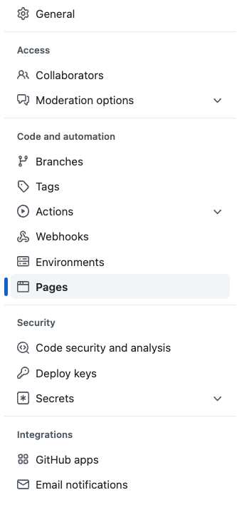

# Deploy to GitHub Pages

### 1. Navigate to the `Settings` tab on your repository on Github.

### 2. On the left hand side click on `Pages`

### 3. Under `Branch` select your `main` branch and click `Save`

### Now come back in <5 minutes, refresh this page and you'll see the link to your deployed site :sunglasses: